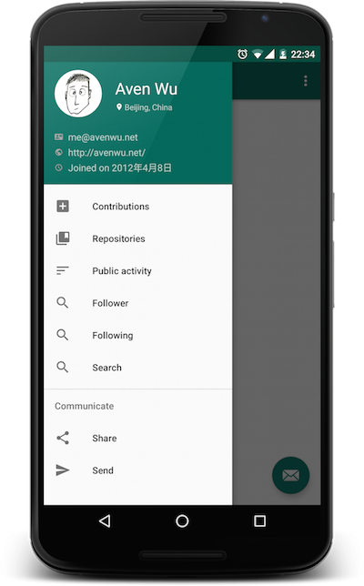
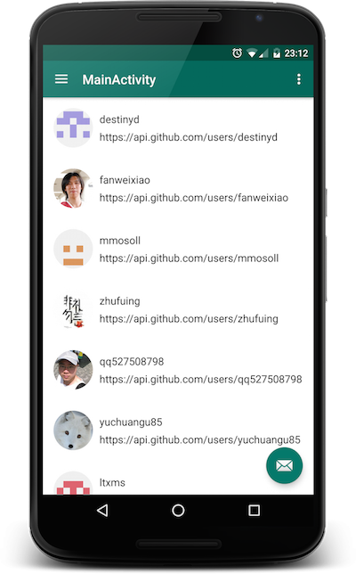

YoYo
======

YoYo GitHub is an android application based on open api provided by GitHub team.
For more information see [the website][1]

Why
--------

GitHub hosts thousands of open-source projects, it would be nice to have an well designed android
 client; however they are focused mainly on web side feature and have stopped maintaining the
 official android application. So I decided to make one to satisfy myself.

This project will follow the [material design][2] style, you may fork and make changed freely under
the LICENCE

Preview
--------

Attention! YoYo is currently in develop, these are some screenshots for early preview.

License
-------

    Licensed under the Apache License, Version 2.0 (the "License");
    you may not use this file except in compliance with the License.
    You may obtain a copy of the License at

       http://www.apache.org/licenses/LICENSE-2.0

    Unless required by applicable law or agreed to in writing, software
    distributed under the License is distributed on an "AS IS" BASIS,
    WITHOUT WARRANTIES OR CONDITIONS OF ANY KIND, either express or implied.
    See the License for the specific language governing permissions and
    limitations under the License.

 [1]: http://avenwu.net/yoyo
 [1]: http://www.google.com/design/spec/material-design/introduction.html